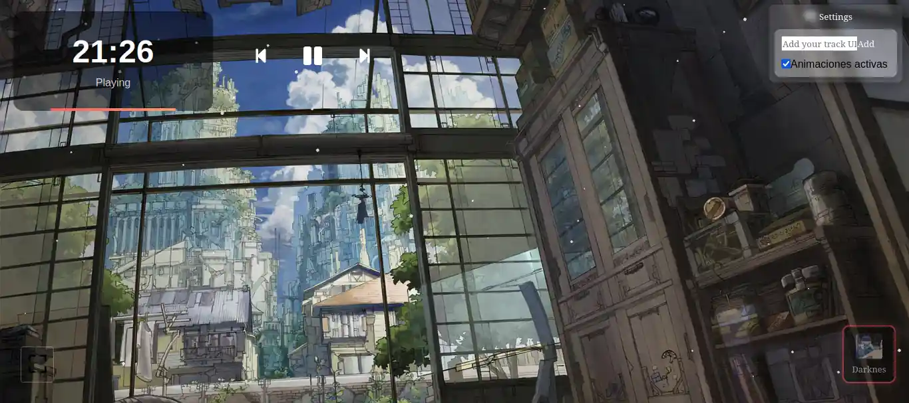

# ChillWeb - Música de Fondo Lofi

ChillWeb es una aplicación web sencilla construida con React y Vite. Proporciona un fondo relajante con música lofi para ayudarte a concentrarte o relajarte.

## Captura
<!--  -->

## Características

- Configuración mínima utilizando React y Vite.
- Reemplazo de Módulos en Caliente (HMR) para una experiencia de desarrollo fluida.
- Reproducción de música lofi para un ambiente tranquilo.
    
## Comenzando

1. Clona el repositorio.
2. Instala las dependencias usando `npm install`.
3. Inicia el servidor de desarrollo con `npm run dev`.

¡Disfruta de un entorno pacífico y productivo con ChillWeb!
